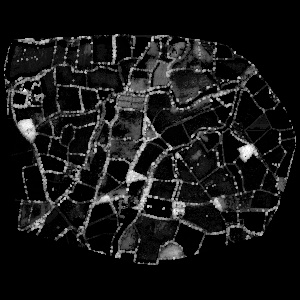

# veg-outline

Detect and extract curvilinear vegetation outlines in vegetation height models derived from **aerial point cloud data**.  

---

## 🌿 Overview

This project focuses on extracting **curvilinear features**—such as vegetation outlines or field boundaries—from spatially aggregated LiDAR or other point cloud data.  
Each input raster represents a **Vegetation Height Model (VHM)** where each pixel stores the **95th percentile height** of points within a 10 × 10 meter grid cell.

<p align="center">
  
</p>

---

## 🎯 Objectives

- Detect curvilinear and boundary-like patterns in vegetation height surfaces.  

---

## 🧪 Example Workflow

```python
from veg_outline import data as vd

# Load vegetation height model (VHM)
image = vd.load_geotiff("UK_Knepp_10m_veg_TILE_000_BAND_perc_95_normalized_height.tif")
```


